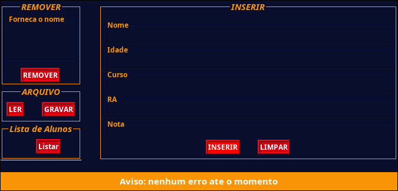
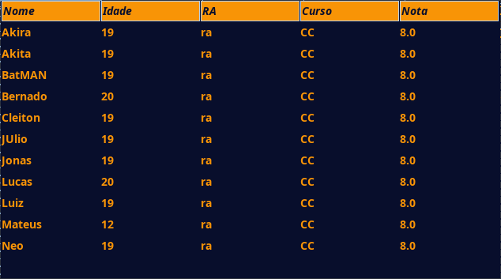

# Sobre
- Feito no 3 período do curso de Ciência da Computação 
- Matéria: Laboratório de Estruturas Dinâmicas
- Objetivo era implementar um projeto usando Estruturas de Dados Linear

# Estrutura de Dados

- É possivel usar um array simples ou uma array de lista ligada 

- Por padrão é utilizado um array, de tamanho 26, de lista ligada. Esta Estrutura de dados 
  pode ser representada com um dicionário onde cada seção dele representa uma lista ligada que 
  contém  apenas as pessoas que possui a primeira letra do nome igual as demais. Cada seção é colocado em ordem alfabética, assim como os nomes de cada seção.


# Imagens





# Organização de Arquivos (Tree)
```
├── Arquivo/
│   ├──  ArquivoTexto.java
│   └──  InterArquivo.java
├──  CadastroApp.java
├── CadastroJanela.java
├── GuiEssentials/
│   ├──  Botao.java
│   ├──  CampoTexto.java
│   ├──  GuiUtils.java
│   └──  Rotulo.java
├── Model/
│   ├── Armazenagem/
│   │   ├── Array/
│   │   │   └──  CadastroArray.java
│   │   ├──  IArmazenagem.java
│   │   └── ListaLigada/
│   │       ├──  CadastroMultiLista.java
│   │       ├──  ListaLigada.java
│   │       ├──  No.java
│   │       └──  Teste.java
│   └── Essentials/
│       ├──  Aluno.java
│       ├──  CadastroValidacao.java
│       ├──  NomePessoa.java
│       ├──  Pessoa.java
│       └──  Texto.java
├── Painel/
│   ├── Eventos/
│   │   ├──  ArquivoEventos.java
│   │   ├──  InserirEventos.java
│   │   ├──  ListarEventos.java
│   │   └──  RemoverEventos.java
│   ├──  JanelaTabela.java
│   ├──  PainelArquivo.java
│   ├──  PainelInserir.java
│   ├──  PainelListar.java
│   ├──  PainelMensagem.java
│   └──  PainelRemover.java
├── README.md
└── Save/
    └──  Teste.txt
```


